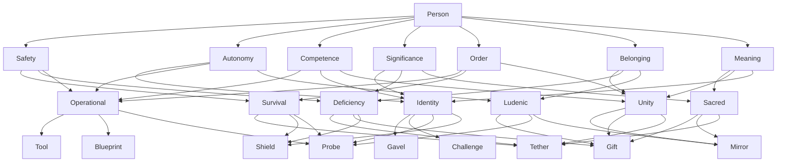

# Rule of Three Flowchart

Person → Needs → Worldviews → Gambits

```mermaid
flowchart TB
    Person[Person]
    
    Person --> Safety
    Person --> Autonomy
    Person --> Competence
    Person --> Significance
    Person --> Order
    Person --> Belonging
    Person --> Meaning
    
    Safety --> Survival
    Safety --> Deficiency
    Safety --> Operational
    
    Autonomy --> Identity
    Autonomy --> Operational
    Autonomy --> Ludenic
    
    Competence --> Operational
    Competence --> Identity
    Competence --> Unity
    
    Significance --> Identity
    Significance --> Deficiency
    Significance --> Sacred
    
    Order --> Operational
    Order --> Survival
    Order --> Unity
    
    Belonging --> Unity
    Belonging --> Deficiency
    Belonging --> Ludenic
    
    Meaning --> Sacred
    Meaning --> Unity
    Meaning --> Identity
    
    Survival --> Tether
    Survival --> Shield
    Survival --> Probe
    
    Deficiency --> Tether
    Deficiency --> Gift
    Deficiency --> Shield
    
    Identity --> Gavel
    Identity --> Challenge
    Identity --> Probe
    Identity --> Shield
    
    Operational --> Tool
    Operational --> Blueprint
    Operational --> Probe
    
    Unity --> Mirror
    Unity --> Gift
    Unity --> Tether
    
    Ludenic --> Gift
    Ludenic --> Probe
    Ludenic --> Mirror
    
    Sacred --> Gift
    Sacred --> Mirror
    Sacred --> Tether
```
